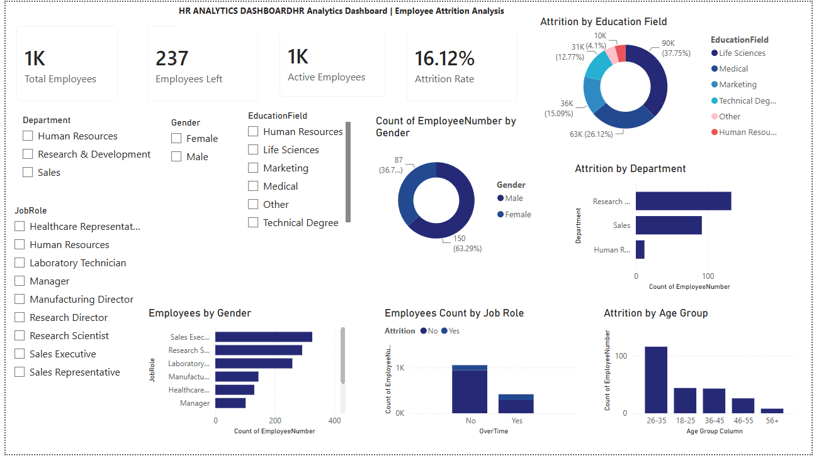

# HR Analytics Dashboard | Employee Attrition Analysis

## 📌 Project Overview

This Power BI dashboard analyzes employee attrition data to identify workforce trends and key factors contributing to employee attrition.

## 📊 Dashboard KPIs

- Total Employees: 1,470
- Employees Left: 237
- Active Employees: 1,233
- Attrition Rate: 16.12%

## 📈 Dashboard Features

- Employees by Department
- Employees by Gender
- Employees by Age Group
- Attrition by Department
- Attrition by Education Field
- Overtime vs Attrition
- Employees by Job Role
- Interactive Filters

## 🛠 Tools Used

- Power BI
- Power Query
- DAX
- Excel

## 📂 Files

- HR_Analytics_Dashboard.pbix
- HR_Dashboard.png
- WA_Fn-UseC_-HR-Employee-Attrition.csv

## 👨‍💻 Author

**Rajat Rangra**
